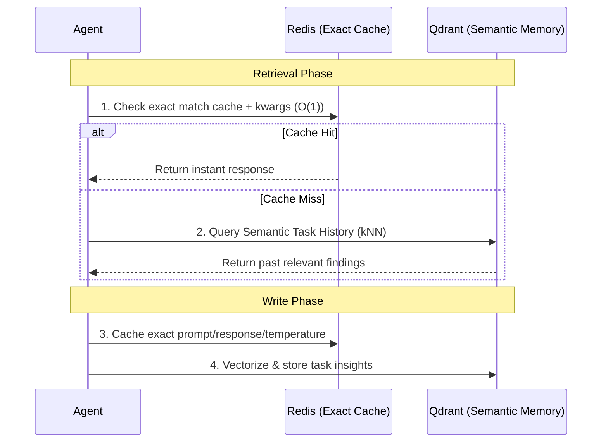

# Multi-Agent Orchestrator

A robust, multi-agent orchestration system powered by LangGraph. This system is designed to autonomously solve complex tasks by breaking them down, planning an execution strategy, and delegating subtasks to highly specialized agents. 

The system operates entirely on a resilient, free-tier LLM API stack featuring Groq, Z.ai, OpenRouter, and HuggingFace, with comprehensive fallback chains and configurable cooldowns to survive strict rate limits. It utilizes Docker for required infrastructure services like Redis (caching) and Qdrant (semantic memory).

---

## Architecture Diagram

```mermaid
graph TD
    User[User Query] --> Orch[Orchestrator<br/>Decomposes Task]
    Orch --> Planner[Planner<br/>Formulates Execution Plan]
    
    Planner -->|Assigns Subtasks| Agents
    
    subgraph Specialists [Specialist Agents]
        R[Researcher<br/>Web Search]
        C[Coder<br/>Code Generation]
        DA[Data Analyst<br/>Data Interpretation]
        SQL[SQL Assistant<br/>DB Queries]
    end
    
    Agents --> Validation
    
    subgraph Validation [Validation Layer]
        CE[Code Evaluator<br/>Edge Case Testing]
        FC[Fact Checker<br/>Verification]
    end
    
    Validation --> Reviewer[Reviewer<br/>Quality Assurance]
    
    Reviewer -->|Needs Revision| Orch
    Reviewer -->|Approved / Max Cycles| Aggregator[Aggregator<br/>Synthesizes Final Output]
    Validation -.->|Fast-path (Research only)| Aggregator
    
    Aggregator --> Output[Final Output]
```

### Memory & Caching Flow



## Core Features & Workflow

- **Orchestrator & Planner:** Tasks are intelligently decomposed into atomic subtasks by the Orchestrator, prioritized into a logical execution order by the Planner, and fanned out to specific specialists.
- **Deep Validation Layer:** The `code_evaluator` autonomously tests generated code against adversarial edge cases. The `fact_checker` verifies the researcher's output. Any contradictions or test failures forcibly route the state to the Reviewer.
- **Reviewer Feedback Loop:** The Reviewer evaluates the holistic output and acts as a strict QA gate. If the verdict is `needs_revision`, the task routes back to the Orchestrator for another pass (up to `MAX_REVIEW_CYCLES`), pausing via a configurable `RETRY_COOLDOWN_SECONDS` to allow provider rate-limits to recover.
- **Resilient Model Routing:** Built-in fallback chains utilizing Tenacity for exponential backoffs. If a primary provider hits a `429 Too Many Requests` or `402 Payment Required`, the router seamlessly cascades to free-tier fallback models. 
- **Advanced Semantic Caching:** Prevents cross-topic cache poisoning by isolating semantic cache embeddings via strict agent-scoped namespaces. The Redis layer enforces exact key matching combining `agent_name`, the prompt, and LLM hyperparameters (`temperature`, `max_tokens`).
- **LangSmith Tracing:** Integrated out-of-the-box observability to trace agent execution paths, subtask routing, tool usage, and latencies.

## Setup & Installation

**Prerequisites:**
- Docker Desktop
- Ollama
- Python 3.11+
- Git

### 1. Installation

Clone the repository and set up a virtual environment:
```bash
git clone <repo_url>
cd <repo_name>
python -m venv .venv

# Activate on Linux/macOS
source .venv/bin/activate  
# Activate on Windows
.venv\Scripts\activate

pip install -r requirements.txt
```

### 2. Environment Configuration

Copy `.env.example` to `.env` and populate the required API keys:
- `GROQ_API_KEY`       → console.groq.com (High-speed Llama models, generous free tier)
- `OPENROUTER_API_KEY` → openrouter.ai (Access to Gemma, Qwen, Llama free tiers)
- `ZAI_API_KEY`        → z.ai/chat (glm-4.7-flash)
- `HF_TOKEN`           → huggingface.co (Serverless Inference Providers)
- `TAVILY_API_KEY`     → tavily.com (Web search tool)
- `LANGCHAIN_API_KEY`  → smith.langchain.com (Free developer tier for tracing)
- `SECRET_KEY`         → run: `openssl rand -hex 32`

### 3. Infrastructure Services

Start the Redis and Qdrant backend services using Docker:
```bash
docker compose up -d
```

Pull the required local embedding model via Ollama:
```bash
ollama pull nomic-embed-text
```

## Running the Application

### Verification
Run the system diagnostics to ensure API keys, Docker containers, and embeddings are correctly configured:
```bash
python scripts/run_all_checks.py
```
*(All checks must show PASS before launching the app).*

### Start the UI
Launch the Gradio web interface:
```bash
python app.py
```
Open your browser to `http://localhost:7860`.

## Provider Stack (config/agents.yaml)

To maximize reliability on free tiers without hitting 402/429 errors, model routing is strictly defined in `config/agents.yaml`. We currently use Groq's high-speed Llama-3 endpoints as the primary engines across the board to navigate HuggingFace credit exhaustion and API saturation, supported by robust fallback chains.

| Agent | Primary Model | Fallback Chain |
|---|---|---|
| **Orchestrator** | `groq:llama-3.3-70b-versatile` | `openrouter`, `zai` |
| **Planner** | `groq:llama-3.3-70b-versatile` | `huggingface`, `zai` |
| **Researcher** | `groq:llama-3.1-8b-instant` | `openrouter`, `zai` |
| **Fact Checker** | `groq:llama-3.3-70b-versatile` | `huggingface`, `zai` |
| **Coder** | `groq:llama-3.3-70b-versatile` | `huggingface`, `zai` |
| **Code Evaluator** | `groq:llama-3.3-70b-versatile` | `huggingface`, `zai` |
| **Reviewer** | `groq:llama-3.3-70b-versatile` | `openrouter`, `zai` |
| **Aggregator** | `groq:llama-3.3-70b-versatile` | `huggingface`, `openrouter`, `zai` |
| **Data Analyst** | `groq:llama-3.1-8b-instant` | `huggingface`, `zai` |
| **SQL Assistant** | `groq:llama-3.3-70b-versatile` | `huggingface`, `zai` |

### Why these specific models?

1. **Groq (Llama 3.3 70B & 3.1 8B) for Speed & Consistency:**
   Groq is the primary engine for most agents. Speed is essential here because a single user query often requires multi-agent invocations. Groq's high throughput prevents the user from waiting minutes for an answer.
2. **Deep, Redundant Fallback Chains:**
   When multiple agents run sequentially, they rapidly drain free-tier request limits. To survive `429 Too Many Requests` or `402 Payment Required` errors, the `Tenacity` router automatically cascades to robust secondary models (like `DeepSeek-R1`, `gemma-4-26b`, and `GLM-5.2`), ensuring the pipeline completes instead of crashing midway.

## Adding a New Agent

The architecture is highly modular. To add a new specialist agent:
1. **Configure:** Add a new block to `config/agents.yaml` with `primary` and `fallback` providers.
2. **Implement:** Create `agents/new_agent.py` containing a `new_agent_node(state) -> dict` function.
3. **Permissions:** Add necessary tool access grants to `config/permissions.yaml`.
4. **Wire:** Import and attach the new node to the LangGraph compiled state in `graph.py`.
