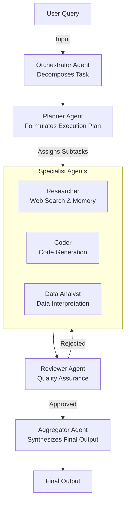
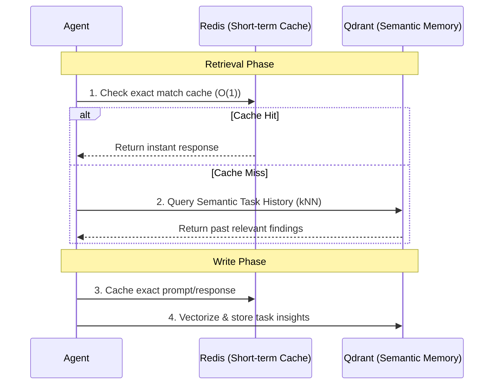

# Multi-Agent Orchestrator

A robust, multi-agent orchestration system powered by LangGraph. This system is designed to autonomously solve complex tasks by breaking them down, planning an execution strategy, and delegating subtasks to specialized agents (Researcher, Coder, Data Analyst). 

The system operates entirely on a resilient, free-tier LLM API stack featuring Groq, Z.ai, and OpenRouter, with comprehensive fallback mechanisms to survive strict rate limits. It utilizes Docker for required infrastructure services like Redis (caching) and Qdrant (semantic memory).

---

## Architecture Diagram



### Memory & Caching Flow



## Core Features & Recent Improvements

- **Resilient Model Routing:** Built-in fallback chains utilizing Tenacity for exponential backoffs. If a primary provider hits a `429 Too Many Requests`, the router seamlessly cascades to free-tier OpenRouter models (`google/gemma-4`, `qwen/qwen3-coder`) and `Z.ai`.
- **Advanced Semantic Caching:** Prevents cross-topic cache poisoning by isolating semantic cache embeddings via strict agent-scoped namespaces. Semantic threshold is set to `0.95` to prevent false positive matches.
- **Long-term Vector Memory:** The system writes findings to a Qdrant vector database keyed by a persistent `user_id`. Agents query this task history before searching the web to prevent redundant lookups.
- **Vagueness Pre-checking:** The orchestrator utilizes a deterministic regex pre-check to reject ambiguous prompts before spending valuable LLM tokens.
- **LangSmith Tracing:** Integrated out-of-the-box observability to trace agent execution paths, subtask routing, tool usage, and latencies.

## Setup & Installation

**Prerequisites:**
- Docker Desktop
- Ollama
- Python 3.11+
- Git

### 1. Installation

Clone the repository and set up a virtual environment:
```bash
git clone <repo_url>
cd <repo_name>
python -m venv .venv

# Activate on Linux/macOS
source .venv/bin/activate  
# Activate on Windows
.venv\Scripts\activate

pip install -r requirements.txt
```

### 2. Environment Configuration

Copy `.env.example` to `.env` and populate the required API keys:
- `GROQ_API_KEY`       → console.groq.com (High-speed Llama models, generous free tier)
- `OPENROUTER_API_KEY` → openrouter.ai (Access to Gemma, Qwen, Llama free tiers)
- `ZAI_API_KEY`        → z.ai/chat → API Keys (glm-4.7-flash)
- `TAVILY_API_KEY`     → tavily.com (Web search tool)
- `LANGCHAIN_API_KEY`  → smith.langchain.com (Free developer tier for tracing)
- `SECRET_KEY`         → run: `openssl rand -hex 32`

### 3. Infrastructure Services

Start the Redis and Qdrant backend services using Docker:
```bash
docker compose up -d
```

Pull the required local embedding model via Ollama:
```bash
ollama pull nomic-embed-text
```

## Running the Application

### Verification
Run the system diagnostics to ensure API keys, Docker containers, and embeddings are correctly configured:
```bash
python scripts/run_all_checks.py
```
*(All checks must show PASS before launching the app).*

### Start the UI
Launch the Gradio web interface:
```bash
python app.py
```
Open your browser to `http://localhost:7860`.

## Testing

Run the test suite using pytest:
```bash
pytest tests/ -v
pytest evals/ -v
```

## Validation Scenarios

To manually verify that the Orchestrator routes tasks correctly and that caching/memory functions work, try running the following queries in the Gradio UI:

1. **Pure research, no code**
   *Query:* `What are the key differences between transformer and mamba architecture for language models?`
   *Expected:* Researcher + Aggregator activate. Web Search tool used. Coder is idle.

2. **Pure code, minimal research**
   *Query:* `Write a Python class that implements a thread-safe LRU cache with a configurable max size`
   *Expected:* Coder agent + run_python agentic loop activate. Researcher provides minimal/no findings.

3. **Full pipeline (research feeds code)**
   *Query:* `Research how to use the Qdrant Python client to perform filtered vector search, then write a working example script`
   *Expected:* All agents activate. Researcher gathers docs, Coder uses those docs in its context to write the script.

4. **Data analysis**
   *Query:* `Explain the mathematical intuition behind cosine similarity and write Python code to compute it from scratch without using any libraries`
   *Expected:* Data Analyst and Coder both activate. Output contains both mathematical explanation and implementation.

5. **Multi-part task (Orchestrator decomposition)**
   *Query:* `Compare FastAPI and Flask for building REST APIs, write a hello world endpoint in both frameworks, and summarize which is better for async workloads`
   *Expected:* Orchestrator decomposes this into 3+ subtasks. All specialists invoked.

6. **Reviewer revision cycle trigger**
   *Query:* `Write a production-ready Python decorator that retries a function on failure with exponential backoff, including proper logging, type hints, and unit tests`
   *Expected:* The Reviewer is highly likely to reject the first draft due to the strict "production-ready + tests" requirement. Watch `review_cycles` exceed 1.

7. **Short factual (Cache test)**
   *Query:* `What is the CAP theorem?`
   *Expected:* Run this once (takes ~10-15s). Run it again immediately. The second run should trigger a Redis semantic cache hit, with latency dropping to <1s.

8. **Ambiguous task (Orchestrator fallback test)**
   *Query:* `Help me with my project`
   *Expected:* The Orchestrator's vagueness pre-check intercepts this. It asks for clarification without wasting LLM tokens.

9. **Long context (Memory + Aggregator stress)**
   *Query:* `Research the history of neural networks from the perceptron in 1958 to modern transformers in 2024, covering all major milestones, key papers, and the researchers behind them`
   *Expected:* Researcher produces heavy findings. Aggregator successfully synthesizes a massive context block without hitting token limits or memory write failures.

10. **Code with external data (Tool use chain)**
    *Query:* `Write a Python script that fetches the current Bitcoin price from a free public API and displays it with a timestamp, including error handling for network failures`
    *Expected:* Researcher uses `web_fetch` to find a public API endpoint, passes finding to Coder. Coder writes and tests the script using `run_python`.

## Provider Stack (config/agents.yaml)

To maximize reliability on free tiers without hitting 402/429 errors, the model routing is strictly defined in `config/agents.yaml`:

| Agent | Primary Model (Fast) | Fallback Chain (Resilient) |
|---|---|---|
| **Orchestrator** | `groq:llama-3.3-70b-versatile` | `zai`, `openrouter:llama-3.3-70b` |
| **Planner** | `groq:llama-3.3-70b-versatile` | `zai`, `openrouter:llama-3.3-70b` |
| **Researcher** | `groq:llama-3.1-8b-instant` | `zai`, `openrouter:llama-3.3-70b` |
| **Coder** | `groq:llama-3.3-70b-versatile` | `openrouter:gemma-4-26b`, `zai` |
| **Data Analyst**| `groq:llama-3.1-8b-instant` | `openrouter:qwen3-coder`, `zai` |
| **Reviewer** | `groq:llama-3.3-70b-versatile` | `openrouter:gemma-4-26b`, `zai` |
| **Aggregator** | `groq:llama-3.3-70b-versatile` | `zai`, `openrouter:gemma-4`, `openrouter:qwen3` |

### Why these specific models?

The selection of LLMs is designed around three core realities of free-tier APIs: **Speed**, **Reasoning Capability**, and **Rate-Limit Resilience**.

1. **Groq (Llama 3.3 70B & 3.1 8B) for Speed & Tool-calling:**
   Groq is the primary engine for most agents (`Researcher`, `Coder`, `Reviewer`, `Aggregator`). It runs on specialized LPUs, making it incredibly fast. Speed is essential here because a single user query often requires 5-10 sequential agent invocations. Groq's high throughput prevents the user from waiting minutes for an answer.

2. **DeepSeek (Reasoner/Chat) for Strategic Planning:**
   DeepSeek is explicitly configured as the primary model for the `Planner` and `Orchestrator`. These agents don't need to read large web pages; instead, they need to perform deep logical deduction, step-by-step task breakdown, and strict JSON instruction-following. DeepSeek excels at architectural reasoning.

3. **Deep, Redundant Fallback Chains (The "Aggregator" Survival Strategy):**
   When multiple agents run sequentially, they rapidly drain the free-tier requests-per-minute (RPM) limits. By the time the final `Aggregator` agent runs, primary APIs (like Groq) often return a `429 Too Many Requests` error. 
   To survive this, the system uses deep fallback chains composed of robust OpenRouter free models (`gemma-4`, `qwen3`, `llama-3.3`). If one model is rate-limited, the `Tenacity` router automatically cascades to the next one, ensuring the pipeline completes instead of crashing midway.

*(Note: DeepSeek endpoints were deliberately removed from the default fallback chains due to frequent `402 Payment Required` hard-failures on exhausted free accounts, which wasted time on useless network requests).*

## Adding a New Agent

The architecture is highly modular. To add a new specialist agent:
1. **Configure:** Add a new block to `config/agents.yaml` with `primary` and `fallback` providers.
2. **Implement:** Create `agents/new_agent.py` containing a `new_agent_node(state) -> dict` function.
3. **Permissions:** Add necessary tool access grants to `config/permissions.yaml`.
4. **Wire:** Import and attach the new node to the LangGraph compiled state in `graph.py`.
